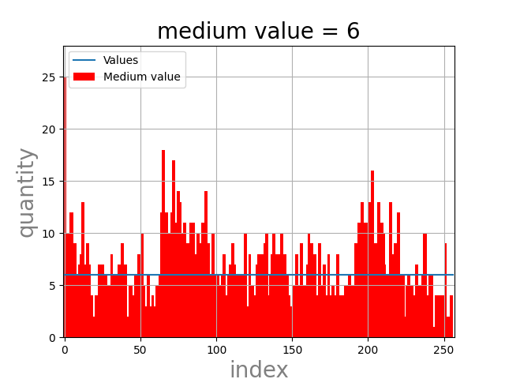
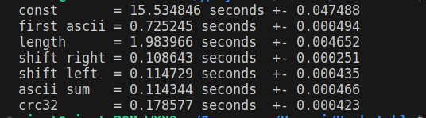
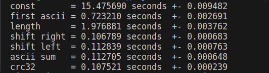
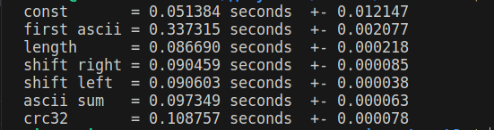

# Hash-таблицы

## Задачи:
* написать Hash-таблицу
* написать 7 Hash-функций;
* Найти самую быструю функцию для вычисления хэша
* написать 3 оптимизации для ускорения поиска элементов Hash-таблицы;
    * asm-вставка
    * intrinsics-функции
    * функция из *.asm

## Ход работы
# Hash-функции:
## 1) Обработка текста
программа [text_handler.cpp](handle_text/text_handler.cpp) обрабатывает файл [TEXT_FILE](general/dsl.h) в файл [HANDLED_FILE](general/dsl.h) для дальнейшего считывания.
## 2) Считывание текста из **HANDLED_FILE**
## 3) Создание Hash-таблиц с помощью Hash-функций (Размер таблиц - [HASH_TABLE_SIZE](general/dsl.h))

|hash всегда 0|hash = ASCII коду первого символа слова|
|:--:|:--:|
| | |
| Hash = длина слова | Hash = сумма ASCII кодов каждого символа в строке |
| | |
|Hash = сдвиг по кругу вправо от предыдущего хеша | Hash = сдвиг по кругу влево от предыдущего хеша|
| | |
|Crc32|
||

medium value - среднее медианное значение.
 ## 3) Время выполнения

С помощью инструмента Valgrind засекаем время работы всех функций. Получаем


Как мы видим, самые "прожорливые" функции, которые поддаются оптимизации - **strlen**, **strcmp** и **crc32**. Ими мы и займемся!!!

1) **strlen** - пишем asm-вставку

<details>
<summary>my_strlen</summary>

```C
int new_strlen(char* word)
{
    int len = 0;
    __asm__ ("push %1; \n\t"
            "mov rcx, 100; \n\t"
            "mov rsi, %1; \n\t"
            "mov al, 0; \n\t"
            "repne scasb; \n\t"
            "mov %0, 99; \n\t"
            "sub %0, ecx; \n\t"
            "pop %1; \n\t"
            : "=a"(len)
            : "g"(word));
    return len;
}
```
</details>


2) crc32 - сделаем asm-файл.

<details>
<summary>my_crc32</summary>

```assembly
my_crc32:
    xor rax, rax
    mov eax, -1
    mov r11, 0
Next_iter:
    crc32 eax, byte [rdi + r11]
    inc r11
    cmp r11, rsi
    jb Next_iter
    ret
```
</details>

3) strcmp - реализуем через SIMD-инструкции

<details>
<summary>fast_strcmp</summary>

```C
int fast_strcmp(char* s1, char* s2)
{
    __m256i v1, v2, cmp_result;
    int mask = 0;
    const __m256i zero = _mm256_setzero_si256();

    while (1) {
        v1 = _mm256_loadu_si256((__m256i*)s1);
        v2 = _mm256_loadu_si256((__m256i*)s2);

        cmp_result = _mm256_cmpeq_epi8(v1, v2);
        mask = ~_mm256_movemask_epi8(cmp_result);

        if (mask != 0)
        {
            int index = __builtin_ctz(mask) - 1;
            return (s1[index] == '\0' && s2[index] == '\0') ? 0 : -1;
        }

        s1 += 32;
        s2 += 32;
    }
    return 0;
}
```
</details>
Оцениваем время по поиску 4 700  000 элементов.

|без оптимизации|-O3|
|:--:|:--:|
| | |
| -O3 и crc32 | -O3, STRCMP и crc32 |
| | |
|-O3, len, crc32 и my_strcmp|
||

# Вывод
* оптимальной функцией для вычисления хеша оказалась функция crc32.
* с помощью низкоуровневого кода и флагов оптимизации нам удалось ускорить нашу программу.
