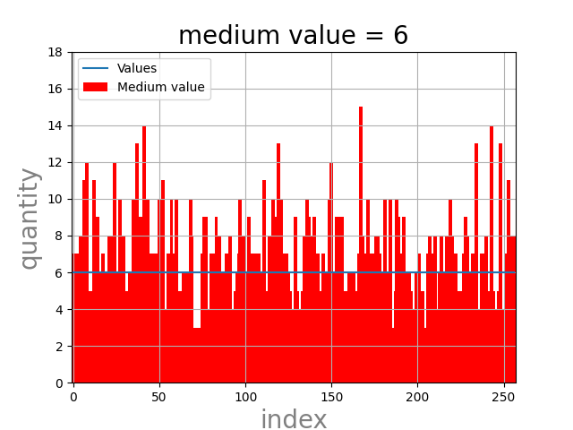

# Hash-таблицы

## Задачи:
* написать Hash-таблицу
* написать 7 Hash-функций;
* написать 3 оптимизации;
    * asm-вставка
    * intrinsics-функции
    * функция из *.asm

## Ход работы
# Hash-функции:
## 1) Обработка текста
программа [text_handler.cpp](handle_text/text_handler.cpp) обрабатывает файл [TEXT_FILE](general/dsl.h) в файл [HANDLED_FILE](general/dsl.h) для дальнейшего считывания.
## 2) Считывание текста из **HANDLED_FILE**
## 3) Создание Hash-таблиц с помощью Hash-функций (Размер таблиц - [HASH_TABLE_SIZE](general/dsl.h))

|hash всегда 0|hash = ASCII коду первого символа слова|
|:--:|:--:|
| | |
| Hash = длина слова | Hash = сумма ASCII кодов каждого символа в строке |
| | |
|Hash = сдвиг по кругу вправо от предыдущего хеша | Hash = сдвиг по кругу влево от предыдущего хеша|
| | |
|Crc32|
||

medium value - среднее медианное значение.
